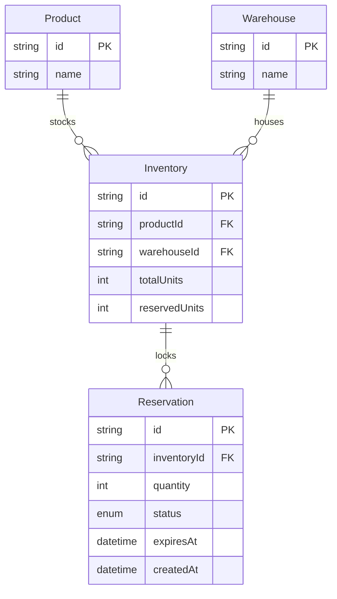

# Allo Reservation System 🛒📦

Hey! This is a project I built to solve a really common problem in online shopping: **double-booking**. Imagine two people clicking "Buy" on the very last item in stock at the exact same millisecond. If we aren't careful, both orders might go through, and we'd have to apologize to one of them! 

To fix this, I built a warehouse reservation dashboard using **Next.js**, **Prisma**, and **Supabase (PostgreSQL)** that uses database locking to make sure only one person can reserve an item at a time.

---

## 🌐 Live Demo

> [!IMPORTANT]
> **Check out the live website here:** 
> ## 👉 **[allo-reservation-system-delta.vercel.app](https://allo-reservation-system-delta.vercel.app/)** 👈
>
> *The database is fully hosted and pre-seeded, so you can interact with products and warehouses immediately!*

---

## 🛠️ The Tech Stack I Used

*   **Frontend & Backend:** Next.js (App Router)
*   **Database:** Supabase (PostgreSQL)
*   **ORM:** Prisma (to talk to the database easily)
*   **Styling & UI:** Simple CSS with nice animations (using Sonner for toast alerts)

---

## 📐 How the Database is Structured

Here is a quick look at how the data is organized (Product, Warehouse, Inventory, and Reservations):



---

## 🔒 How I Solved the Double-Booking Problem (The Fun Part!)

### ❌ The Wrong Way: "Read, Check, then Write"
Usually, you might do something like this in your code:
1. Look at the database to see how many items are left.
2. If there is enough stock, say "Yes, you can have it!"
3. Update the database to show the new stock.

But if Person A and Person B try to buy the last item at the exact same millisecond, they will **both** see 1 item left in Step 1. Both checks pass, and both get it. That's a double-booking!

###  The Right Way: PostgreSQL Row Locking (`FOR UPDATE`)
To prevent this, I used **pessimistic locking**. Inside a database transaction, we run a query like this:
```sql
SELECT * FROM "Inventory" WHERE id = $1 FOR UPDATE
```
The `FOR UPDATE` part tells the database: *"Hey, lock this row! Nobody else is allowed to touch or read this specific item's stock until I am done updating it."*

So:
1. **Person A's request** locks the row and checks the stock.
2. **Person B's request** tries to check, but PostgreSQL makes them wait in line.
3. Person A successfully reserves the item, stock goes to 0, and they unlock the row.
4. Person B finally gets their turn, reads the stock (which is now 0), and gets a "Sorry, out of stock!" error instead of booking it.

---

## ⏳ Cleaning Up Expired Reservations (Lazy Cleanup)

When someone starts reserving an item, they have a limited time to confirm their order (like a countdown timer when buying concert tickets). If they change their mind or close the tab, we need to release that stock so others can buy it.

Instead of running an expensive background server or cron job, I wrote a **Lazy Cleanup on Read** system:
*   **How it works:** Every time a user visits the product dashboard or hits the `/api/products` endpoint, a silent database sweep is run before fetching the active data.
*   **Atomic Stock Reversion:** In a single transaction, the server queries for any `PENDING` reservations where `expiresAt < now`. For each expired reservation, it:
    1.  Frees the stock back to the inventory (decrements the inventory's `reservedUnits`).
    2.  Updates the status of those reservations to `RELEASED`.
*   **Zero infrastructure overhead:** Expired holdings are cleaned up naturally on-demand without any cron jobs or scheduled workers!

### 🌍 How this works in Production
In production, this lazy cleanup mechanism is extremely efficient because database sweeps only trigger when people are actually using the app. This works perfectly under high traffic:
*   **High Traffic:** If thousands of users are browsing, the sweeps are frequent, ensuring inventory is released almost the exact second it expires.
*   **Zero Traffic / Quiet Hours:** If there is zero traffic, expired reservations won't be swept *immediately* at the exact minute they expire. However, they will be cleaned up the very millisecond the next user loads the products or tries to make a reservation, meaning no user ever sees incorrect stock!
*   **Production Backup / Vercel Cron:** If we want to guarantee cleanup even when no one is using the site, we can easily set up a simple **Vercel Cron Job** that hits our `/api/cleanup` endpoint every 1-5 minutes to sweep the database in the background.

---

## 📡 API Routes

*   `GET /api/products` — Cleans up any expired reservations and shows all products with their live stock counts.
*   `GET /api/warehouses` — Fetches the list of warehouses.
*   `POST /api/reservations` — Tries to reserve an item using database locking. Takes `{ inventoryId, quantity }`.
*   `GET /api/reservations/[id]` — Gets all details for a specific reservation.
*   `POST /api/reservations/[id]/confirm` — Confirms the reservation (makes it permanent).
*   `POST /api/reservations/[id]/release` — Cancels the reservation manually and frees up the stock.
*   `POST /api/cleanup` — Manual trigger to sweep and clean up expired reservations.

---

## 🚀 How to Run It Locally

### 1. Set up your `.env` file
Create a file named `.env` in the folder `allo-reservation-system/` and add your Supabase connection strings:
```env
DATABASE_URL="your-supabase-connection-string-with-pgbouncer"
DIRECT_URL="your-direct-supabase-connection-string"
```

### 2. Install dependencies
```bash
npm install
```

### 3. Sync the database
```bash
npx prisma generate
npx prisma migrate dev --name init
```

### 4. Seed the database (adds some dummy products and warehouses)
```bash
npx prisma db seed
```

### 5. Start the development server
```bash
npm run dev
```
Now, open [http://localhost:3000](http://localhost:3000) in your browser!

---

## 🧠 Tradeoffs & What I'd Do Differently with More Time

Since this is a focused exercise, I made some intentional tradeoffs to make the core reservation logic solid. Here is what I chose to skip, and what I would do differently if I had more time:

1.  **Skipped Redis Distributed Locks (Tradeoff):**
    *   *What I did:* I relied fully on PostgreSQL row-level locks (`SELECT ... FOR UPDATE`). For a single Postgres database, this is incredibly fast, simple, and 100% concurrency-safe.
    *   *With more time:* If this app had to scale to millions of users across multiple databases, I would use **Redis (with Redlock)** to manage locks instantly in memory before hitting the database.
2.  **No Background Workers / Cron Jobs by default (Tradeoff):**
    *   *What I did:* Relied entirely on dynamic Lazy Cleanup on product/page fetches.
    *   *With more time:* In production, a robust background worker like BullMQ, Temporal, or a Vercel Cron Job would handle automated sweeps asynchronously so there is zero transaction overhead added to user product queries.
3.  **Idempotency (Tradeoff):**
    *   *What I did:* Skipped implementation of the `Idempotency-Key` headers for reservations.
    *   *With more time:* I would add a middleware or database table to track `Idempotency-Key` values for active API requests. If a request is retried (e.g. client network drops right after buying), the server would return the saved response instead of executing the transaction again.
4.  **No User Authentication (Tradeoff):**
    *   *What I did:* Focused purely on inventory locking and API concurrency. Anyone can reserve stock anonymously.
    *   *With more time:* I would integrate **NextAuth** or **Clerk** to associate reservations with unique User IDs, tracking active user reservation histories.
5.  **No Optimistic UI (Tradeoff):**
    *   *What I did:* Triggered loading spinners, awaited API responses, and then refetched state.
    *   *With more time:* Implement React Server Actions or TanStack Query to show UI updates instantly (optimistically) and rollback only if the server returns a `409` or `410` error.


